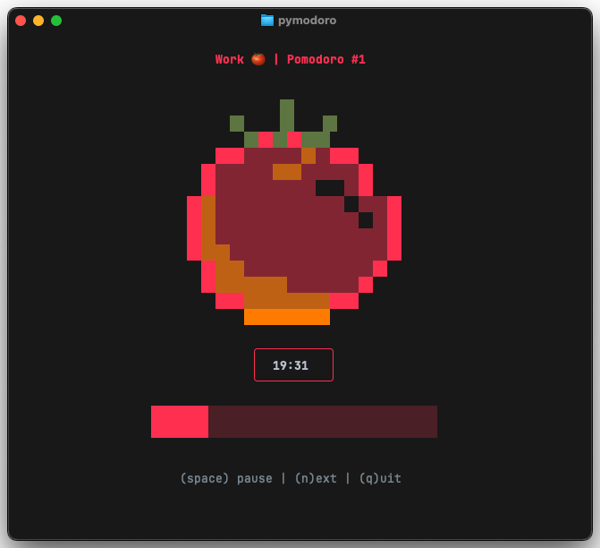

# 🍅 Pymodoro

**A beautiful command-line Pomodoro timer built with Python and Rich**

[](https://python.org)
[](https://opensource.org/licenses/MIT)
[](https://github.com/psf/black)

Pymodoro brings the famous Pomodoro Technique to your terminal with a gorgeous interface, session-aware colors, chunky progress bars, and delightful ASCII art. Stay focused, take breaks, and boost your productivity—all from the comfort of your command line.




## ✨ Features

- 🎨 **Beautiful TUI** - Rich terminal interface with session-aware colors
- 🍅 **Visual Progress** - Chunky progress bars and ASCII tomato art
- 🔊 **Audio Notifications** - Sound alerts for session transitions
- ⏸️ **Pause/Resume** - Full control over your timer
- 🔄 **Session Reset** - Restart current session from the beginning when distracted
- 🛡️ **Smart Confirmations** - Prevent accidental skips, resets, and quits
- 📊 **Session Logging** - Persistent daily logs with timestamps and notes
- 🎯 **Customizable Sessions** - Configure work, short break, and long break durations
- ⌨️ **Keyboard Controls** - Intuitive single-key commands
- 📝 **Log Management** - Reset logs or edit with your preferred editor

## 🚀 Quick Start

### Install uv (if you don't have it)

```bash
# macOS and Linux
curl -LsSf https://astral.sh/uv/install.sh | sh

# Windows
powershell -ExecutionPolicy ByPass -c "irm https://astral.sh/uv/install.ps1 | iex"

# Or with pip
pip install uv
```

### Why uvx?

**Try before you install!** With `uvx`, you can run Pymodoro instantly without any installation or setup. Perfect for:
- ✨ **One-time usage** - Test the tool without commitment
- 🧪 **Quick trials** - Try different configurations easily  
- 🚀 **Zero setup** - No virtual environments or dependencies to manage
- 🔄 **Always latest** - Runs the latest version from the repository

### Installation

```bash
# Run directly with uvx (no installation needed!)
uvx --from git+https://github.com/emson/pymodoro.git pymodoro

# Or install from source with uv (recommended for development)
git clone https://github.com/emson/pymodoro.git
cd pymodoro
uv sync
uv run pymodoro

# Install globally with uv
uv tool install git+https://github.com/emson/pymodoro.git
# Update it with
uv tool upgrade pymodoro
# Uninstall
uv tool uninstall pymodoro

# Traditional pip install (if you prefer)
pip install git+https://github.com/emson/pymodoro.git
```

### Usage

```bash
# If using uvx (run without installing)
uvx --from git+https://github.com/emson/pymodoro.git pymodoro
uvx --from git+https://github.com/emson/pymodoro.git pymodoro -w 45 -s 10

# If installed globally
pymodoro
pymodoro -w 45 -s 10 -l 30

# If using uv run from source
uv run pymodoro
uv run pymodoro --work 50 --short 15

# See all options
pymodoro --help
```

## 🎮 Keyboard Controls

| Key | Action |
|-----|--------|
| `SPACE` | Pause/Resume current session |
| `N` | Skip to next session (with confirmation) |
| `R` | Reset current session to beginning (with confirmation) |
| `Q` | Quit application (with confirmation) |

## 📖 How It Works

Pymodoro follows the traditional Pomodoro Technique:

1. **Work Session** (25 min) - Focus on your task 🍅
2. **Short Break** (5 min) - Quick rest ☕
3. **Repeat 3 more times**
4. **Long Break** (15 min) - Extended rest 🛋️
5. **Start over**

The interface changes colors based on your current session:
- **Red** for work sessions
- **Green** for short breaks  
- **Blue** for long breaks
- **Yellow** when paused

### Session Control

**Reset Functionality**: Sometimes you get distracted or interrupted during a session. Instead of continuing with less focus or skipping to the next session, you can **reset** the current session to start fresh:

- **During Work Sessions**: Press `R` to restart your Pomodoro from 25 minutes (or your custom duration)
- **During Breaks**: Press `R` to restart your break timer - perfect when you need a full break after an interruption
- **Smart Confirmations**: Reset requires confirmation to prevent accidents, showing exactly what session and time will be reset
- **Preserved Context**: Your Pomodoro number stays the same - you're just restarting the current session, not losing progress

**When to Reset**:
- 🔔 Got interrupted by a phone call or meeting
- 💭 Lost focus and want a fresh start
- ☕ Break got interrupted and you need the full rest time
- 🎯 Want to restart with renewed concentration

## ⚙️ Configuration

### Command Line Options

```bash
pymodoro [OPTIONS]

Timer Options:
  -w, --work MINUTES     Work session duration (default: 25)
  -s, --short MINUTES    Short break duration (default: 5)
  -l, --long MINUTES     Long break duration (default: 15)
  -n, --notify MINUTES   Warning sound N minutes before session ends (default: 1)
  -f, --frequency COUNT  Work sessions before long break (default: 4)

Session Management:
  --reset_log           Reset today's session log to empty and exit
  --open_log            Open today's session log in default editor and exit

General:
  -h, --help            Show help message
  --version             Show version information
```

### Examples

```bash
# Focus mode - longer work sessions (using uvx)
uvx --from git+https://github.com/emson/pymodoro.git pymodoro -w 50 -s 10

# Quick sprints - shorter work sessions (if installed)
pymodoro -w 15 -s 5

# Custom everything (using uv run from source)
uv run pymodoro --work 45 --short 15 --long 30

# Configure warnings and long break frequency
pymodoro -n 2 -f 3    # 2-minute warning, long break every 3 sessions

# Session log management
pymodoro --reset_log  # Clear today's session history
pymodoro --open_log   # Edit today's session log with notes
```

## 🎯 The Pomodoro Technique

The Pomodoro Technique is a time management method developed by Francesco Cirillo in the late 1980s. It uses a timer to break work into intervals, traditionally 25 minutes in length, separated by short breaks.

**Benefits:**
- Improved focus and concentration
- Better time estimation
- Reduced mental fatigue
- Increased productivity
- Better work-life balance

[Learn more about the Pomodoro Technique](https://en.wikipedia.org/wiki/Pomodoro_Technique)

## 🛠️ Development

### Requirements

- Python 3.13+
- [uv](https://github.com/astral-sh/uv) - Fast Python package installer
- Rich library for terminal UI (automatically installed)
- Standard library modules (termios, select, etc.)

### Setup

```bash
# Install uv if you haven't already (see above)
curl -LsSf https://astral.sh/uv/install.sh | sh

# Clone the repository
git clone https://github.com/emson/pymodoro.git
cd pymodoro

# Sync dependencies and create virtual environment
uv sync

# Run the application
uv run pymodoro

# Or activate the environment and run directly
source .venv/bin/activate  # On Windows: .venv\Scripts\activate
pymodoro
```

### Project Structure

```
pymodoro/
├── src/pymodoro/
│   ├── __init__.py
│   ├── __main__.py      # CLI entry point and main loop
│   ├── interface.py     # Rich TUI components
│   ├── timer.py         # Pomodoro timer logic
│   ├── keyboard.py      # Keyboard input handling
│   └── sound.py         # Audio notifications
├── pyproject.toml       # Project configuration
└── README.md
```

## 🐛 Troubleshooting

### Common Issues

**Keyboard input not working:**
- Ensure your terminal supports the required input modes
- Try running in a different terminal emulator

**No sound notifications:**
- Check your system's terminal bell settings
- Ensure your terminal emulator supports audio alerts

**Display issues:**
- Make sure your terminal supports Unicode characters
- Ensure your terminal window is at least 80 characters wide

## 🤝 Contributing

Contributions are welcome! Here's how you can help:

1. **Fork the repository**
2. **Create a feature branch** (`git checkout -b feature/amazing-feature`)
3. **Make your changes**
4. **Add tests** if applicable
5. **Commit your changes** (`git commit -m 'Add amazing feature'`)
6. **Push to the branch** (`git push origin feature/amazing-feature`)
7. **Open a Pull Request**

### Development Guidelines

- Use `uv` for dependency management and virtual environments
- Follow PEP 8 style guidelines  
- Add docstrings to new functions and classes
- Update README.md if you add new features
- Test your changes on different terminal emulators
- Run `uv sync` after adding new dependencies

## 📝 License

This project is licensed under the MIT License - see the [LICENSE](LICENSE) file for details.

## 🙏 Acknowledgments

- **Francesco Cirillo** - Creator of the Pomodoro Technique
- **[Rich](https://github.com/Textualize/rich)** - For the beautiful terminal UI framework
- **The Python Community** - For the amazing ecosystem
- **[Pomopy](https://github.com/sophiezhng/pomopy)** - for inspiration and ASCII art

## 🔗 Links

- [Pomodoro Technique Official Website](https://francescocirillo.com/pages/pomodoro-technique)
- [Rich Documentation](https://rich.readthedocs.io/)
- [Report Issues](https://github.com/emson/pymodoro/issues)

---

Made with ❤️ and lots of 🍅 by [Ben Emson](https://github.com/emson)
